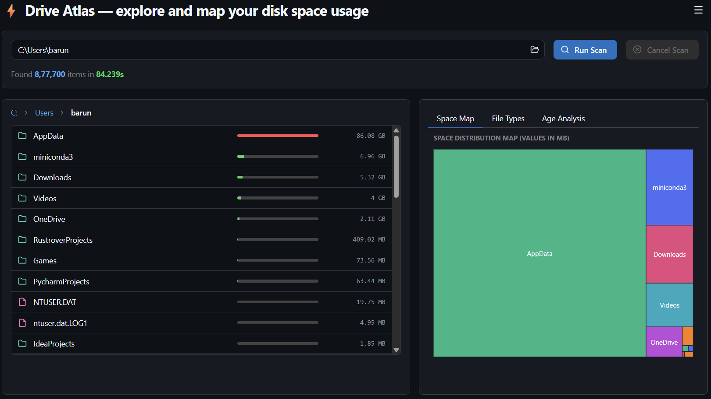

# Drive Atlas

<p align="center">
  
</p>

Drive Atlas is a fast, lightweight desktop disk usage explorer and analyzer built with Tauri v2, Rust, React, and TypeScript.

Drive Atlas is inspired by the simplicity of `ncdu`. It adds more visualizations on the top of that to gain better insights.


## ⚡ Features

- **Fast Parallel Scanning:** Traverses directory trees concurrently using Rust's multi-threaded `jwalk` engine.
- **Interactive Visualizations:**
  - **Space Distribution Map:** High-performance storage treemap (MB) powered by Mantine Charts.
  - **Extension Breakdown:** Top 15 file extensions by storage utilization.
  - **File Age Analysis:** Scatter plot visualizing file size vs. age (months since last modification).
- **In-App File Management:** Open files or folders directly in native OS file managers or safely move items to system trash.
- **Security Hardened:** Path canonicalization guards against relative traversal, strict Content Security Policy (CSP), and system root deletion protection.
- **Cross-Platform Compatibility:** Normalized path matching handling backslashes (`\`), forward slashes (`/`), and case insensitivity across Windows, macOS, and Linux.

<p align="center">
  
</p>


## 🚀 Getting Started

### Prerequisites

- [Node.js](https://nodejs.org/) (v18+)
- [Rust](https://www.rust-lang.org/) (stable toolchain)

### Development

Install dependencies:
```bash
npm install
```

Run the application in development mode:
```bash
npm run tauri dev
```

### Production Build

Build the optimized desktop binary:
```bash
npm run tauri build
```


## 📜 License

Drive Atlas is an Open-Source software, released under Apache 2.0 license.
